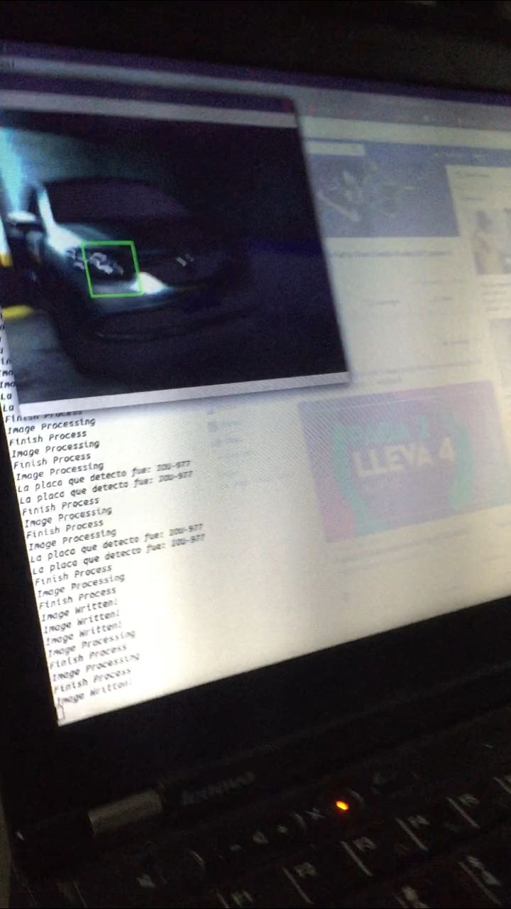
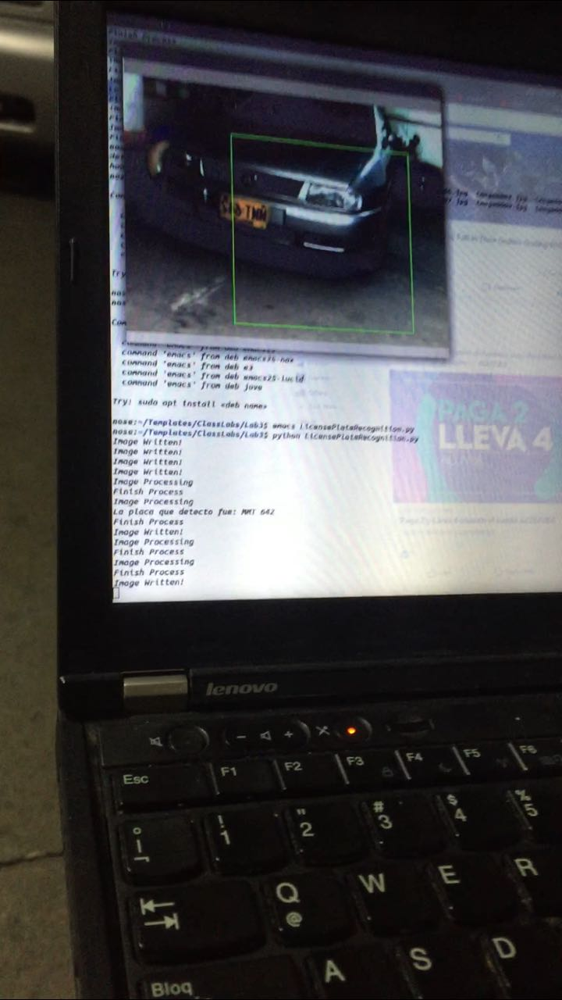
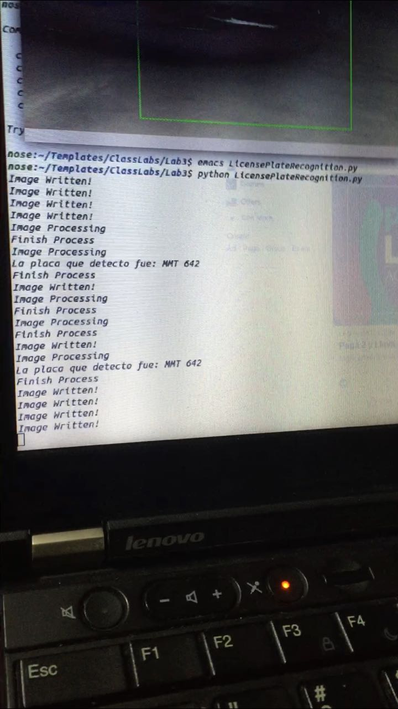

# Proyecto Final Tópicos en Ingeniería de Telemática 
   ### Identificacion de placas de vehiculo en tiempo real
  
  # INTEGRANTES DEL GRUPO:
- **JUAN PABLO ALCARAZ FLOREZ**
- **ALEJANDRO CORDOBA BODHERT**
- **CRAIG DAVID CARTAGENA CASTANO**

# PROFESOR:
- **EDWIN NELSON MONTOYA MUNERA**


# UNIVERSIDAD DE EAFIT

# INGENIERIA DE SISTEMAS

# 2018


  ## DESCRIPCION DEL PROYECTO
  
  El proyecto consiste en identificar placas de vehiculos colombianos en tiempo real. A traves de una camara.

  ## TECNOLOGIAS
  
  

   - [OPENCV](https://opencv.org/): es una biblioteca libre de visión artificial originalmente desarrollada por Intel. 
   
   - [PYTHON](https://www.python.org/): es un lenguaje de programación interpretado cuya filosofía hace hincapié en una sintaxis que favorezca un código legible.
   
   - [AWS BUCKET](https://docs.aws.amazon.com/es_es/AmazonS3/latest/dev/UsingBucket.html): Amazon S3 es un almacenamiento en la nube para Internet. Para poder cargar sus datos (fotos, vídeos, documentos, etc.) primero ha de crear un bucket en una de las regiones de AWS. Luego puede cargar la cantidad de objetos que desee en el bucket.   
   
   - [AWS TEXT RECOGNITION](https://docs.aws.amazon.com/rekognition/latest/dg/text-detection.html): Amazon Rekognition Text in Image puede detectar texto en imágenes y convertirlo en texto legible por máquina. 
   
   ## EJECUCION
   
   se debe tener la webcam conectada al computador, con referencia al puerto al cual esta conectado.
   

  ``` $ python3 LicensePlateRecognition.py  ```


   ## Dependencias

   Se requiere la instalación por medio del manejador de paquetes de Python, pip; diferentes bibliotecas requeridas para el correcto funcionamiento de la Script.
   
   - $ pip3 install multiprocessing
   - $ pip3 install boto3
   - $ pip3 install csv2
   - $ pip3 install re
   - $ pip3 install json

   ## Funcionamiento
   
   - Se identifica en la webcam vehiculos que se esten movilizando en tiempo real
   
``` python
def license_plate_recognition():
faceCascade = cv2.CascadeClassifier('haarcascade_cars.xml')
video_capture = cv2.VideoCapture(0)
cpt = 0
```
    
   - Al indentificar un vehiculo toma la foto del vehiculo
   
   
   
```python
if len(photo) > 4:
 picture = "image%04i.jpg" %cpt
  cv2.imwrite(picture, frame)
  thread = multiprocessing.Process(target=amazon_aws, args=(picture,))
  thread.start()
  cpt += 1
 print("Image Written!")
 ```
         
            
            
   - Al tener la foto del vehiculo, se va identificar rectangulos en dicha foto, Se reconocen los rectangulos, se le aplica el text recognition de aws a los rectangulos detectados en la imagen.
   
   
   
```python
      for (x, y, w, h) in faces:
            cv2.rectangle(frame, (x, y), (x+w, y+h), (0, 255, 0), 2)
         frame_copy = cv2.flip(frame, 1)
         cv2.imshow('Video', frame_copy)
         fps = video_capture.get(cv2.CAP_PROP_FPS)
         if cv2.waitKey(1) & 0xFF == ord('q'):
            break
    video_capture.release()
    cv2.destroyAllWindows() 
   ```
    
    
 
   - Con la expresiones regulares ('([A-Z][A-Z][A-Z] [0-9][0-9][0-9])\Z') y ('([A-Z][A-Z][A-Z]-[0-9][0-9][0-9])\Z') se limita al reconocimiento de texto que identifique las placas y por ultimo, se utiliza un metodo que encuentre similitudes con la expresion regular.
   
   
   
```python
    def amazon_aws(image):
    s3=boto3.resource('s3')
    bucket='telematicaequipo3'
    s3=boto3.resource('s3')
    photo=image
    client=boto3.client('rekognition')
    s3.meta.client.upload_file(photo, bucket, photo)
    response=client.detect_text(Image={'S3Object':{'Bucket':bucket,'Name':photo}})
    textDetections=response['TextDetections']
    print("Image Processing")
    for text in textDetections:
        cadena = text['DetectedText']
        patron = re.compile('([A-Z][A-Z][A-Z] [0-9][0-9][0-9])\Z')
        patron2 = re.compile('([A-Z][A-Z][A-Z]-[0-9][0-9][0-9])\Z')
        if patron.match(cadena) or patron2.match(cadena):
            print("La placa que detecto fue: " + cadena)
    print("Finish Process") 
  ```
    
  
   
## Referencias

https://docs.opencv.org/3.0-beta/doc/py_tutorials/py_gui/py_video_display/py_video_display.html
